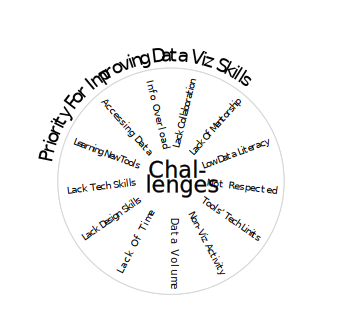
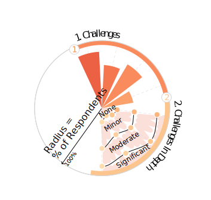
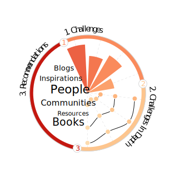

```js
import { FileAttachment } from "npm:@observablehq/stdlib";

```

<div class="hero">
  <h1>Data Visualization Challenges and Inspirations</h1>
  <p>The Data Visualization Society launched their annual <a href="https://www.datavisualizationsociety.org/soti-challenge-2023">State of the Industry survey</a> for 2023. The survey asked people about challenges they faced while visualizing data and how much it affected their work. It also asked where they wanted to improve and where they found inspiration.</p>
  <p>Explore the different stages of the respondents' data visualization journeys. The interactive chart walks you through the respondents' next area of focus, the challenges they faced, and their sources of inspiration. Hover over the chart elements to see more details.
  </p>
</div>

<div class="main-section">
  <div class="text-description-container">
    <div id="stepper-container">
      <div class="text-description annotation-step" id="annotation-step-0">
                <h1>What Area Of Focus Do Respondents Want To Focus On Next?</h1>
                <p>
                    Each bubble represents a unique area of focus<sup>1</sup> that the respondent wants to pursue next. The size is based on the number of respondents.
                </p>
                <p>
                    Within each bubble, there will be data for each of the 14 challenges asked in the survey. Each challenge is positioned radially and takes up a slice in their bubble. Click <span style="font-family: 'Patrick Hand SC', sans-serif; color: var(--color-dark-red); font-weight: bold;">Next</span> to proceed.
                </p>
      </div>
      <div class="text-description annotation-step" id="annotation-step-1">
                <h1>How Much Does Each Challenge Affect Respondents In Their Data Visualization Work?</h1>
                <p>
                    Each bar has a corresponding color which represents a challenge. The height of each bar is based
                    on its relative impact score<sup>2</sup>. The larger the bar, the greater the impact respondents felt by that challenge. 
                </p>
                <p>Hover over the bars to see the relative impact scores.</p>
      </div>
      <div class="text-description annotation-step" id="annotation-step-2">
                <h1>What Is The Distribution Of Impact For Each Challenge?</h1>
                <p>
                    Sometimes understanding relative impact as a single number does not provide enough detail. Some respondents could be completely unaffected while others could be on the oppositie spectrum, entirely bogged down by it. 
                </p>
                <p>Hover over the circles and spaces between to see who responded with what.</p>
        </div>
        <div class="text-description annotation-step" id="annotation-step-3">
                <h1>What Resources Do Respondents Recommend To Get Inspiration?</h1>
                <p>
                    When asked about sources of inspiration, respondents named various people and resources<sup>3</sup>. 
                    The word clouds show the most common sources grouped by areas of priority.
                </p>
        </div>
    </div>
    <div class="legend-container">
        
        
        
        
    </div>
    <div id="stepper-nav">
            <div id="step-back" class="step-button">Back</div>
            <div id="step-next" class="step-button">Next</div>
    </div>
  </div>
  <div id="chart">
    <div id="tooltip" class="hidden"></div>
  </div>
</div>
<div class="footer">
  <div><strong>Data Visualization Encodings</strong></div>
  <div style="flex-direction: row; display: flex; max-height: 400px; width: 600px; align-items: flex-start;">
    
    
  </div>
  <div><strong>Methodology</strong></div>
  <div><sup>1</sup>Priority: Freeform responses were either grouped under the 5 existing options or a new option "Communication" was created. People who did not respond were put in "Unknown". People who answered "I don't feel I need to improve my data visualization skills currently" were put in "None".</div>
  <div><sup>2</sup>Relative Impact Score: Average of the respondents' level of impact (encoding: "No Impact"=0.00, "Minor Impact"=0.33", "Moderate Impact"=0.67, "Significant Impact"=1.00). Blank responses were ignored. The maximum relative impact score is 1, but the visualization was scaled so that the challenge with the highest score would be the cap purely due to aesthetic choices.</div>
  <div><sup>3</sup>Inspirations: Freeform responses on resources and people were both programatically and manually cleaned to handle different sentence structures, fix typos, and consolidate name variants of the same entity. When creating the word cloud, all answers given by the respondents were considered.</div>
  <br>
  <div><strong>Credits</strong></div>
  <div>Survey conducted by <a href="https://www.datavisualizationsociety.org/">Data Visualization Society</a>.</div>
  <div>Data Visualization created by <a href="https://ifcolorful.com/">Sarina Chen</a>.</div>
</div>


```js
import * as d3 from "npm:d3";
import { CONSTANTS } from "./js/constants.js";
import { generateCirclePriority } from "./js/circles-priority.js";
import { generateAxisChallenges, generateBarChallenges, updateBarChallenge } from "./js/bars-challenge.js";
import { generateAreaChallengeImpact, generateLineChallengeImpact } from "./js/lines-challenge-impact.js";
import { generateCircleChallengeImpact } from "./js/circles-challenge-impact.js";
import { generateWordClouds } from "./js/word-cloud.js";
import { generateStepper } from "./js/stepper.js";
```

```js

let svg = d3
    .select("#chart")
    .append("svg")
    .attr("width", CONSTANTS.svgWidth)
    .attr("height", CONSTANTS.svgHeight);

FileAttachment("./data/data.json").json().then((data) => {

    // console.log(data);

    let gBubblePriority = generateCirclePriority(data, svg);

    let barChallenge = generateBarChallenges(gBubblePriority);

    let areaChallenge = generateAreaChallengeImpact(gBubblePriority);
    let axisChallenge = generateAxisChallenges(gBubblePriority)
    let lineChallenge = generateLineChallengeImpact(gBubblePriority);
    let circleChallenge = generateCircleChallengeImpact(gBubblePriority);

    let gWordCloud = generateWordClouds(gBubblePriority);

    generateStepper();

});
```